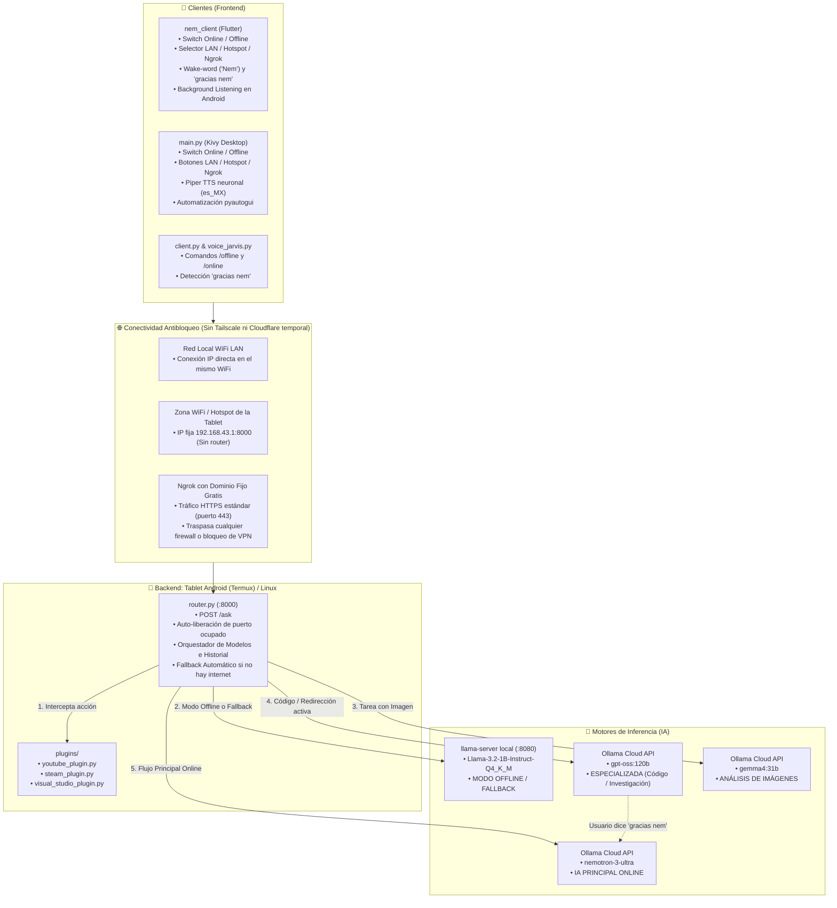

# 🤖 JARVIS / NEM AI — Documento de Arquitectura, Guía de Continuación y Plan Maestro

> **Propósito de este documento:** Este archivo contiene el mapa completo del proyecto, su arquitectura técnica actualizada, flujo de datos híbrido, soporte offline, gestión de sesiones por IA, alternativas de conexión antibloqueo y el plan de evolución a asistente fluido y humano. Diseñado para desarrolladores e inteligencias artificiales que continúen el proyecto.

---

## 📌 1. Visión General del Proyecto

**JARVIS** (asistente nombrada **Nem** o **Nem AI** en la interfaz y comandos de voz) es un asistente virtual personal de **arquitectura híbrida, modular y multimodal**.

### Principios Fundamentales del Sistema:
1. **IA Principal Online (Nemotron 3 Ultra):** Por defecto en modo conectado, todas las consultas cotidianas, razonamiento y conversación general son resueltas por el modelo de alta fidelidad `nemotron-3-ultra` (vía Ollama Cloud API).
2. **Modo Offline & Resiliencia Local:**
   - **Manual:** El usuario puede activar el modo offline en cualquier momento desde la interfaz o por comando de voz/texto (`"modo offline"`).
   - **Automático (Fallback Transparente):** Si no hay conexión a internet o el servidor en la nube no responde, el sistema conmuta instantáneamente al modelo local `Llama-3.2-1B-Instruct-Q4_K_M` en `llama.cpp` alojado en el dispositivo (tablet o PC local).
3. **Sistema de Historial por IAs con Redirección Contextual:**
   - Si una consulta requiere código complejo o investigación profunda, el sistema redirige la conversación al modelo especializado `gpt-oss:120b`.
   - **Persistencia de sesión especializada:** El hilo de conversación y su contexto se mantienen en `gpt-oss:120b` durante todas las preguntas de seguimiento sobre ese tema.
   - **Cierre temático con `"gracias nem"`:** Cuando el usuario dice o escribe `"gracias nem"` o `"gracias"`, se cierra la sesión especializada y el sistema regresa fluidamente a `nemotron-3-ultra`.
4. **Conectividad Robusta Antibloqueo:**
   - **Opción #1 (Local directa):** WiFi LAN o Punto de Acceso Hotspot de la tablet (0% bloqueable, 100% offline).
   - **Opción #2 (Internet remota):** Ngrok con dominio estático gratuito por HTTPS puerto 443 (inmune a bloqueos de VPN y redes institucionales).
5. **Capa de Plugins de Automatización:** Intercepta intenciones para ejecutar aplicaciones del sistema operativo (`steam`, `code`) y controlar reproducción en YouTube sin gastar tokens de IA.

---

## 🏗️ 2. Diagrama de Arquitectura del Sistema



---

## 🌐 3. Alternativas de Conexión Antibloqueo (Cuando las VPNs están bloqueadas)

Cuando Tailscale o WireGuard están bloqueados por el proveedor de internet, la universidad o el firewall local, existen dos soluciones definitivas:

### 🏆 Opción A: Red Local Directa o Hotspot (La más rápida, 0% bloqueable)
Si la tablet y tu PC/móvil están en el mismo espacio físico:
1. **Método 1: En el mismo WiFi de casa:**
   - En la tablet (Termux), averigua su IP local:
     ```bash
     ip addr show wlan0 | grep inet
     ```
     *(Verás algo como `192.168.1.45` o `10.21.209.217`)*.
   - En el cliente (Flutter o Kivy), introduce: `http://TU_IP_LOCAL:8000/ask`.
2. **Método 2: Punto de Acceso (Hotspot de la Tablet - Sin router ni internet):**
   - Enciende la **Zona WiFi / Compartir Internet** en la tablet Android.
   - Conecta tu PC a esa red WiFi.
   - La tablet Android siempre tiene la IP fija: `192.168.43.1`.
   - En el cliente pon: `http://192.168.43.1:8000/ask`. ¡Funciona 100% offline y es imposible de bloquear!

---

### 🌍 Opción B: Ngrok con Dominio Estático Gratuito (Para conectar por Internet fuera de casa)
**¿Por qué funciona si Tailscale está bloqueado?**  
Porque Ngrok viaja encapsulado en **HTTPS estándar por el puerto 443**. Para cualquier firewall, el tráfico luce exactamente igual que navegar por Google o YouTube, por lo que **no se puede filtrar como VPN**. Además, Ngrok ofrece **1 dominio estático gratis para siempre**, lo que significa que la URL **nunca cambia ni caduca**.

#### Configuración en la Tablet (Termux):
1. **Crea tu cuenta gratuita en [ngrok.com](https://ngrok.com):**
   - Ve a la sección **Domains** y reclama tu dominio gratis (ejemplo: `nem-jarvis.ngrok-free.app`).
   - Copia tu **Authtoken** desde el panel.
2. **Instala Ngrok en Termux:**
   ```bash
   pkg install ngrok
   ```
   *(Si no está en el repo de Termux, descarga el binario oficial de Linux ARM64)*:
   ```bash
   curl -s https://bin.equinox.io/c/bNyj1mQVY4c/ngrok-v3-stable-linux-arm64.tgz -o ngrok.tgz && tar -xvzf ngrok.tgz && mv ngrok $PREFIX/bin/
   ```
3. **Agrega tu token en Termux (solo una vez):**
   ```bash
   ngrok config add-authtoken TU_TOKEN_AQUI
   ```
4. **Inicia el túnel con tu dominio estático:**
   ```bash
   ngrok http 8000 --url=tu-nombre.ngrok-free.app
   ```
5. **Configura tus Clientes Nem:**
   - En el cliente Flutter o Kivy, introduce la URL:
     `https://tu-nombre.ngrok-free.app/ask`
   - ¡Listo! Tienes conexión segura y cifrada desde cualquier lugar del mundo.

---

### ⚡ Opción C: Pinggy vía SSH (Sin instalar nada)
Si necesitas un túnel inmediato en Termux sin instalar aplicaciones adicionales:
```bash
ssh -p 443 -R0:localhost:8000 a.pinggy.io
```
Esto genera una URL HTTPS pública directa a través del puerto SSH 443.

---

## 🧠 4. Sistema de Historial por IAs y Redirección Contextual

### Cómo opera el ciclo de vida de la conversación:

```
[Usuario] ──> Pregunta general ──> [Nemotron 3 Ultra (Principal)]
                                            │
[Usuario] ──> "Escribe un script Python" ───┘
     │
     └──> [Redirección activada] ──> [gpt-oss:120b (Especializada)]
               │                             │
               ├── Segundas preguntas        ├── Mantiene historial
               ├── Correcciones de código    └── Contexto acumulado
               │                             │
[Usuario] ──> "gracias nem" o "gracias" ─────┘
     │
     └──> [Cierre temático] ──> "De nada, cierro el tema especializado..."
                                └──> Vuelve automáticamente a [Nemotron 3 Ultra]
```

* **Persistencia:** Mientras el usuario no indique el cierre temático, cada respuesta posterior continúa bajo `gpt-oss:120b` nutriéndose del historial acumulado de la sesión.
* **Comandos de cierre reconocidos:** `"gracias nem"`, `"gracias"`, `"muchas gracias"`, `"listo nem"`, `"cerrar tema"`, `"nuevo tema"`.

---

## 📴 5. Modo Offline y Resiliencia

El asistente cuenta con un sistema de doble vía para operar 100% desconectado:
1. **Vía Manual:**
   - En el cliente Flutter: botón de nube en la barra superior (cambia a naranja 📴).
   - En el cliente Kivy: botón `"🌐 Modo: Online"` / `"📴 Modo: Offline"`.
   - Por voz o texto: decir `"modo offline"`, `"modo local"` o escribir `/offline`.
   - Consulta directamente a `llama.cpp` (`Llama-3.2-1B-Instruct-Q4_K_M`) en el puerto local `8080`.
2. **Vía Automática (Auto-Fallback):**
   - Si se interrumpe la conexión WiFi o Ollama Cloud genera un error HTTP o timeout, el router captura la excepción y ejecuta la consulta de forma transparente en el modelo local de la tablet, notificando en la respuesta:
     `"[Aviso: Sin conexión a la nube. Respuesta generada en modo offline]"`.

---

## 📂 6. Estructura de Archivos del Proyecto

```
/run/media/jinsoon005/juegos/jarvis/jarvis
│
├── JARVIS_SYSTEM_OVERVIEW.md     # Documento maestro actualizado
├── .gitignore                    # Filtro de Git (ignora binarios, temporales y buildozer)
├── router.py                     # Router híbrido con Nemotron, modo offline e historial por IA
├── server.py                     # Servidor en la nube alternativo
├── main.py                       # Cliente Kivy de escritorio con switch Offline y Piper TTS
├── client.py                     # Cliente de terminal interactivo (/offline, /online)
├── voice_jarvis.py               # Cliente de terminal por voz con PipeWire
├── start_jarvis.sh               # Script de encendido dual (llama-server + router) en Termux
├── start.py                      # Script Python equivalente de encendido
├── buildozer.spec                # Configuración de compilación para Android
│
├── plugins/                      # 🔌 Plugins dinámicos cargados automáticamente
│   ├── youtube_plugin.py         # Extracción de URL y auto-reproducción de YouTube
│   ├── steam_plugin.py           # Lanzador del cliente Steam (ACTION:LAUNCH_APP:steam)
│   └── visual_studio_plugin.py   # Lanzador de VS Code (ACTION:LAUNCH_APP:code)
│
├── voices/                       # 🎙️ Modelos ONNX neuronales para Piper TTS
│   ├── es_MX-claude-high.onnx     # Voz principal en español neutro (México)
│   ├── es_ES-davefx-medium.onnx   # Voz secundaria de España
│   └── es_MX-ald-medium.onnx      # Voz alternativa
│
├── piper/                        # Binario ejecutable y librerías de Piper TTS
│
└── nem_client/                   # 📱 Aplicación completa en Flutter (Android / Desktop)
    ├── lib/
    │   └── main.dart             # UI moderna, switch Offline, selector LAN/Hotspot/Ngrok, STT pasivo
    ├── pubspec.yaml              # Dependencias oficiales de Flutter (SDK >=3.0.0 <4.0.0)
    └── android/                  # Manifiesto y servicios en background para Android
```

---

## 🚀 7. Plan Maestro: Hacia un Asistente Personal Fluido y Humano

Para transformar a Nem de un chatbot por turnos a un verdadero **asistente personal de siguiente generación (estilo Jarvis / Gemini Live)**, se establece la siguiente hoja de ruta de implementación técnica:

### Fase 1: Latencia Cero y Conversación Full-Duplex (Voz)
* **Streaming STT en Tiempo Real:** Implementar **Whisper.cpp (modelo tiny/base) local** o streaming WebSocket con VAD (Voice Activity Detection como Silero VAD). El asistente detecta el final del habla en menos de 100ms.
* **Streaming TTS por Oraciones:** En cuanto el LLM genera la primera oración terminada en punto (`.`, `?`, `!`), esa oración entra inmediatamente a síntesis en Piper TTS. La voz empieza a sonar a los **300ms** de haber terminado la pregunta.
* **Interrupción por Voz (Barge-In):** Si el usuario empieza a hablar mientras Nem está hablando, el micrófono detecta la voz del usuario, cancela inmediatamente la reproducción de audio (`pkill aplay`) y procesa la nueva orden.

### Fase 2: Personalidad, Tono y Dinámica Conversacional
* **System Prompt Calibrado:**
  - *"Eres Nem, una compañera y asistente de inteligencia artificial perspicaz, empática y eficiente. Cuando respondas por voz sé conversacional, cálida y directa (máximo 2 a 3 oraciones). Si se requiere código o listas extensas, resume por voz y muestra el detalle en pantalla."*
* **Marcadores Conversacionales Humanos:**
  - Confirmaciones breves no intrusivas ("Entendido", "Dame un momento", "¿Quieres que prepare el entorno?") antes de tareas pesadas.

### Fase 3: Interfaz Visual Reactiva y Emocional (UI/UX)
* **Orbe Neuronal Reactivo (Shader / Canvas Animation):**
  - Un núcleo visual interactivo en Flutter / Kivy que reaccione al audio y al estado (azul = reposo, cian = escuchando, púrpura = pensando, esmeralda = hablando).
* **Widgets Visuales Dinámicos (Generative UI):**
  - Renderizado de tarjetas visuales interactivas para clima, temporizadores, controles multimedia o bloques de código con botón de copiado rápido.

### Fase 4: Memoria a Largo Plazo y Proactividad (RAG Local)
* **Base de Datos de Memoria Persistente (SQLite + Embeddings Locales):**
  - Almacenar preferencias del usuario y proyectos clave para que Nem recuerde información pasada de forma inteligente.
