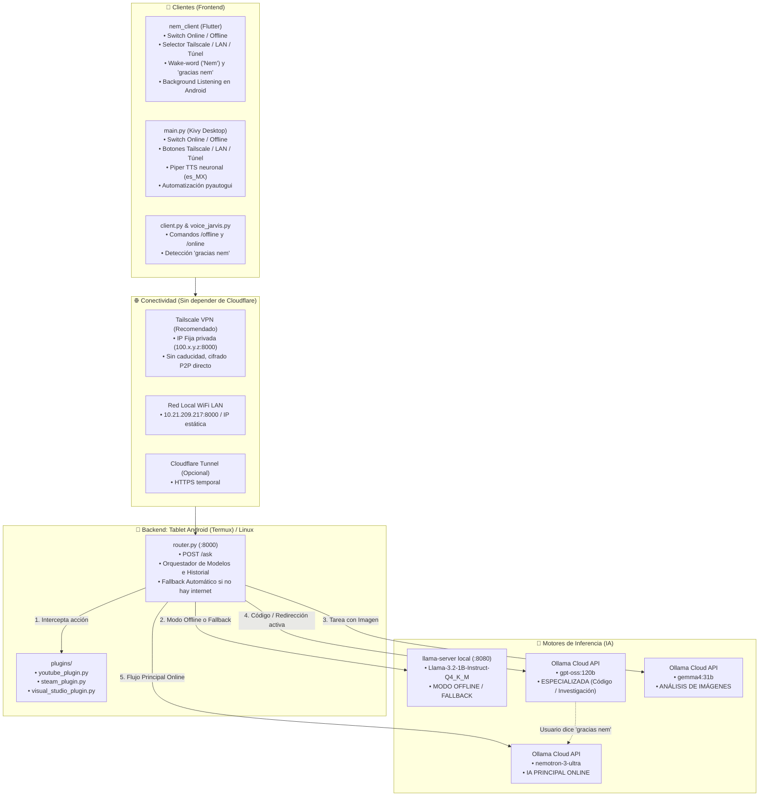

# 🤖 JARVIS / NEM AI — Documento de Arquitectura, Guía de Continuación y Plan Maestro

> **Propósito de este documento:** Este archivo contiene el mapa completo del proyecto, su arquitectura técnica actualizada, flujo de datos híbrido, soporte offline, gestión de sesiones por IA, alternativas de conexión y el plan de evolución a asistente fluido y humano. Diseñado para desarrolladores e inteligencias artificiales que continúen el proyecto.

---

## 📌 1. Visión General del Proyecto

**JARVIS** (asistente nombrada **Nem** o **Nem AI** en la interfaz y comandos de voz) es un asistente virtual personal de **arquitectura híbrida, modular y multimodal**.

### Principios Fundamentales del Sistema:
1. **IA Principal Online (Nemotron 3 Ultra):** Por defecto en modo conectado, todas las consultas cotidianas, razonamiento y conversación general son resueltas por el modelo de alta fidelidad `nemotron-3-ultra` (vía Ollama Cloud API).
2. **Modo Offline & Resiliencia Local:**
   - **Manual:** El usuario puede activar el modo offline en cualquier momento desde la interfaz o por comando de voz/texto (`"modo offline"`).
   - **Automático (Fallback Transparente):** Si no hay conexión a internet o el servidor en la nube no responde, el sistema conmuta instantáneamente al modelo local `Llama-3.2-1B-Instruct-Q4_K_M` en `llama.cpp` alojado en el dispositivo (tablet o PC local).
3. **Sistema de Historial por IAs con Redirección Contextual:**
   - Si una consulta requiere código complejo o investigación profunda, el sistema redirige la conversación al modelo especializado `gpt-oss:120b`.
   - **Persistencia de sesión especializada:** El hilo de conversación y su contexto se mantienen en `gpt-oss:120b` durante todas las preguntas de seguimiento sobre ese tema.
   - **Cierre temático con `"gracias nem"`:** Cuando el usuario dice o escribe `"gracias nem"` o `"gracias"`, se cierra la sesión especializada y el sistema regresa fluidamente a `nemotron-3-ultra`.
4. **Conectividad Moderna (Alternativa a Cloudflare):** Soporte de red privada mallada con **Tailscale VPN** (IP fija privada, sin puertos abiertos ni caducidad de enlaces), además de red local WiFi (LAN) y túneles tradicionales.
5. **Capa de Plugins de Automatización:** Intercepta intenciones para ejecutar aplicaciones del sistema operativo (`steam`, `code`) y controlar reproducción en YouTube sin gastar tokens de IA.

---

## 🏗️ 2. Diagrama de Arquitectura del Sistema



---

## 🌐 3. Alternativa de Conexión Recomendada: Tailscale VPN

### ¿Por qué sustituir Cloudflare Tunnel temporal por Tailscale?
* **Sin caducidad:** Las URLs de `trycloudflare.com` expiran tras unas pocas horas. Tailscale asigna una IP privada fija (rango `100.x.y.z`) o un nombre MagicDNS que **nunca caduca**.
* **Cero configuración de puertos:** Funciona a través de CGNAT, routers bloqueados y redes móviles sin abrir ningún puerto.
* **P2P Ultrarrápido:** Si el cliente y el servidor están en la misma red WiFi, Tailscale conmuta automáticamente a comunicación directa local punto a punto (latencia < 2ms).
* **Seguridad:** Cifrado de grado militar WireGuard de extremo a extremo.

### Configuración en 3 pasos:
1. **En la Tablet (Termux):**
   - Instalar la app de Tailscale para Android desde Play Store o F-Droid e iniciar sesión.
   - La tablet obtendrá una IP fija de Tailscale (ejemplo: `100.64.0.15`).
2. **En tu PC / Teléfono cliente:**
   - Instalar Tailscale e iniciar sesión con la misma cuenta.
3. **En los clientes Nem (Flutter / Kivy / CLI):**
   - Introducir la dirección: `http://100.64.0.15:8000/ask`. ¡Conexión permanente establecida en cualquier lugar del mundo!

---

## 🧠 4. Sistema de Historial por IAs y Redirección Contextual

### Cómo opera el ciclo de vida de la conversación:

```
[Usuario] ──> Pregunta general ──> [Nemotron 3 Ultra (Principal)]
                                            │
[Usuario] ──> "Escribe un script Python" ───┘
     │
     └──> [Redirección activada] ──> [gpt-oss:120b (Especializada)]
               │                             │
               ├── Segundas preguntas        ├── Mantiene historial
               ├── Correcciones de código    └── Contexto acumulado
               │                             │
[Usuario] ──> "gracias nem" o "gracias" ─────┘
     │
     └──> [Cierre temático] ──> "De nada, cierro el tema especializado..."
                                └──> Vuelve automáticamente a [Nemotron 3 Ultra]
```

* **Persistencia:** Mientras el usuario no indique el cierre temático, cada respuesta posterior continúa bajo `gpt-oss:120b` nutriéndose del historial acumulado de la sesión.
* **Comandos de cierre reconocidos:** `"gracias nem"`, `"gracias"`, `"muchas gracias"`, `"listo nem"`, `"cerrar tema"`, `"nuevo tema"`.

---

## 📴 5. Modo Offline y Resiliencia

El asistente cuenta con un sistema de doble vía para operar 100% desconectado:
1. **Vía Manual:**
   - En el cliente Flutter: botón de nube en la barra superior (cambia a naranja 📴).
   - En el cliente Kivy: botón `"🌐 Modo: Online"` / `"📴 Modo: Offline"`.
   - Por voz o texto: decir `"modo offline"`, `"modo local"` o escribir `/offline`.
   - Consulta directamente a `llama.cpp` (`Llama-3.2-1B-Instruct-Q4_K_M`) en el puerto local `8080`.
2. **Vía Automática (Auto-Fallback):**
   - Si se interrumpe la conexión WiFi o Ollama Cloud genera un error HTTP o timeout, el router captura la excepción y ejecuta la consulta de forma transparente en el modelo local de la tablet, notificando en la respuesta:
     `"[Aviso: Sin conexión a la nube. Respuesta generada en modo offline]"`.

---

## 📂 6. Estructura de Archivos del Proyecto

```
/run/media/jinsoon005/juegos/jarvis/jarvis
│
├── JARVIS_SYSTEM_OVERVIEW.md     # Documento maestro actualizado
├── .gitignore                    # Filtro de Git (ignora binarios, temporales y buildozer)
├── router.py                     # Router híbrido con Nemotron, modo offline e historial por IA
├── server.py                     # Servidor en la nube alternativo
├── main.py                       # Cliente Kivy de escritorio con switch Offline y Piper TTS
├── client.py                     # Cliente de terminal interactivo (/offline, /online)
├── voice_jarvis.py               # Cliente de terminal por voz con PipeWire
├── start_jarvis.sh               # Script de encendido dual (llama-server + router) en Termux
├── start.py                      # Script Python equivalente de encendido
├── buildozer.spec                # Configuración de compilación para Android
│
├── plugins/                      # 🔌 Plugins dinámicos cargados automáticamente
│   ├── youtube_plugin.py         # Extracción de URL y auto-reproducción de YouTube
│   ├── steam_plugin.py           # Lanzador del cliente Steam (ACTION:LAUNCH_APP:steam)
│   └── visual_studio_plugin.py   # Lanzador de VS Code (ACTION:LAUNCH_APP:code)
│
├── voices/                       # 🎙️ Modelos ONNX neuronales para Piper TTS
│   ├── es_MX-claude-high.onnx     # Voz principal en español neutro (México)
│   ├── es_ES-davefx-medium.onnx   # Voz secundaria de España
│   └── es_MX-ald-medium.onnx      # Voz alternativa
│
├── piper/                        # Binario ejecutable y librerías de Piper TTS
│
└── nem_client/                   # 📱 Aplicación completa en Flutter (Android / Desktop)
    ├── lib/
    │   └── main.dart             # UI moderna, switch Offline, selector Tailscale, STT pasivo
    ├── pubspec.yaml              # Dependencias oficiales de Flutter
    └── android/                  # Manifiesto y servicios en background para Android
```

---

## 🚀 7. Plan Maestro: Hacia un Asistente Personal Fluido y Humano

Para transformar a Nem de un chatbot por turnos a un verdadero **asistente personal de siguiente generación (estilo Jarvis / Gemini Live)**, se establece la siguiente hoja de ruta de implementación técnica:

### Fase 1: Latencia Cero y Conversación Full-Duplex (Voz)
* **Problema actual:** El cliente graba el audio en bloques de 5 a 10 segundos, lo manda a Google STT, espera que termine el LLM completo y recién entonces Piper genera el audio. Esto produce una latencia perceptible de 2 a 4 segundos.
* **Solución de Voz Humana:**
  1. **Streaming STT en Tiempo Real:** Implementar **Whisper.cpp (modelo tiny/base) local** o streaming WebSocket con VAD (Voice Activity Detection como `webrtcvad` o `Silero VAD`). El asistente sabe cuándo empiezas y cuándo terminas de hablar en menos de 100ms.
  2. **Streaming TTS por Oraciones:** No esperar a que el LLM termine toda su respuesta. En cuanto el LLM genera la primera oración terminada en punto (`.`, `?`, `!`), esa oración entra inmediatamente a síntesis en Piper TTS. La voz empieza a sonar a los **300ms** de haber terminado la pregunta.
  3. **Interrupción por Voz (Barge-In):** Si el usuario empieza a hablar mientras Nem está hablando, el micrófono detecta la voz del usuario, cancela inmediatamente la reproducción de audio (`pkill aplay` o parada de audio) y escucha la nueva orden.

### Fase 2: Personalidad, Tono y Dinámica Conversacional
* **System Prompt Calibrado:**
  - Configurar en Nemotron un System Prompt que diferencie entre respuesta hablada y respuesta escrita:
    *"Eres Nem, una compañera y asistente de inteligencia artificial perspicaz, empática y eficiente. Cuando respondas por voz sé conversacional, cálida y directa (máximo 2 a 3 oraciones). Si se requiere código o listas extensas, resume por voz y muestra el detalle en pantalla."*
* **Marcadores Conversacionales Humanos:**
  - Pequeñas confirmaciones auditivas no intrusivas ("Entendido", "Dame un momento", "¿Quieres que prepare el entorno?") antes de ejecutar tareas pesadas.
  - Modulación de entonación o pausas naturales (`ssml` / puntuación estratégica en Piper).

### Fase 3: Interfaz Visual Reactiva y Emocional (UI/UX)
* **Orbe Neuronal Reactivo (Shader / Canvas Animation):**
  - Sustituir los botones estáticos por un núcleo visual (esfera o anillo de partículas) en Flutter / Kivy que reaccione al audio y al estado:
    - *Azul pulsante suave:* Nem está en reposo escuchando el entorno.
    - *Cian brillante reactivo al volumen:* Nem está escuchándote hablar.
    - *Púrpura giratorio:* Pensando / procesando con Nemotron o gpt-oss.
    - *Verde esmeralda ondulante:* Nem está respondiendo por voz.
* **Widgets Visuales Dinámicos (Generative UI):**
  - Si el usuario pide el clima, un temporizador, o resultados de búsqueda, renderizar tarjetas visuales interactivas en lugar de solo texto plano.

### Fase 4: Memoria a Largo Plazo y Proactividad (RAG Local)
* **Base de Datos de Memoria Persistente (SQLite + Embeddings Locales):**
  - Almacenar preferencias del usuario ("me gusta programar en Flutter", "mis proyectos están en /juegos", "tengo una reunión a las 5").
  - Cada vez que el usuario consulta algo, recuperar fragmentos relevantes de memoria para que Nem recuerde conversaciones pasadas sin necesidad de enviar todo el historial crudo.
* **Proactividad Basada en Eventos:**
  - Integrar tareas programadas en segundo plano: avisos de descanso, recordatorios y alertas sin esperar a que el usuario pregunte.
